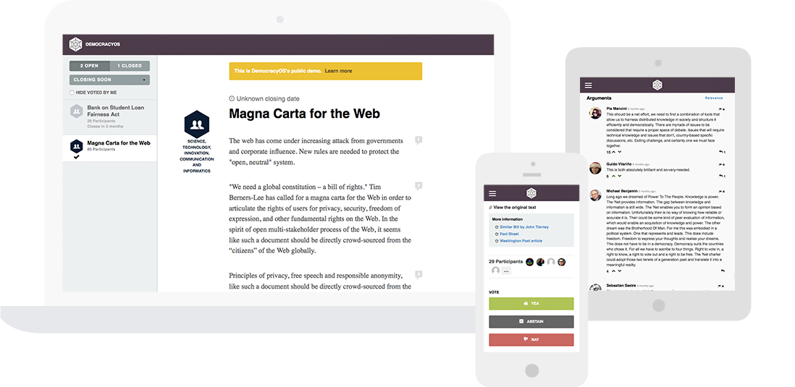
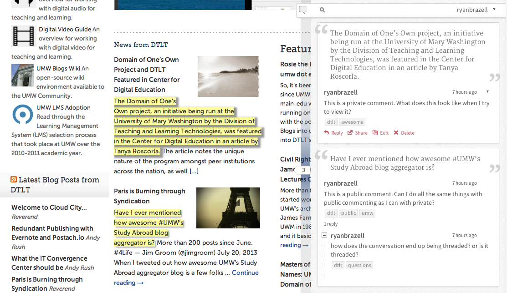

# Democracia Transparente PR

__Objetivo:__ establecer propuesta de producto que ayude al pueblo de Puerto Rico a estar informado sobre legislación, votos de sus representantes y senadores/as, y que provea un canal para que constituyentes se expresen mediante votos, comentarios y/o propuestas de proyecto. 

## Problema

Fuera de temporada de campañas, los constituyentes de los representantes y senadores/as tienen poca o ninguna comunicación con sus legisladores. Esto podría causarc un desbalance entre el poder que tienen cabilderos y otros intereses con acceso al Capitolio y el resto de los ciudadanos de Puerto Rico. 

Con miras a nivelar el campo de juego, queremos utilizar tecnología para crear una conexión constante, transparente y de dos vías entre ciudadanos y sus representantes electos.

## Solución

Utilizaremos la web para crear esta conexión mediante un portal y una aplicación móvil que permita a ciudadanos expresarse sobre legislación, proponer proyectos y comunicarse directamente con sus representantes electos. Además, utilizaremos opiniones y votos de ciudadanos para determinar cuan “eficiente” es cada legislador, determinado por cuán alineado está con la opinión de sus constituyentes.

## Implementación Técnica

Utilizaremos una combinación de proyectos de código abierto como DemocracyOS y código “in-house” desarrollado por un grupo de voluntarios. Entre las tareas técnicas que tomarán más trabajo serán configurar o adaptar DemocracyOS a nuestro uso y desarrollar programas que se conecten con los portales del Senado, Cámara, La Oficina de Servicios Legislativos, entre otros. 

## Implementación Social

Para que un proyecto como este funcione será vital el aval de miembros de la legislatura, así como interés de ciudadanos dispuestos a utilizar este producto frecuentemente. Proponemos tener miembros de la legislatura actual así como ex-miembros de todos los partidos e independientes que de una forma u otra provean ayuda mediante “feedback” de esta propuesta, “beta testing” del product, adopción del producto cuando sea lanzado y finalmente mercadeo del mismo mediante “word of mouth”.

## Detalles

### Stack de tecnología

#### DemocracyOS

[DemocracyOs](http://democracyos.org/) es un sistema de código abierto para deliberar y votar en propuestas políticas. Esta plataforma está diseñada para facilitar un gobierno más abierto y participativo.

#### Hypothes.is

[Hyphotes.is](https://web.hypothes.is/) es un sistema de anotación de texto que podemos utilizar para anotar legislación y comentar directamente en el texto de medidas.

### Código “in-house”

Para tareas particulares de nuestro “use-case” tendremos que desarrollar sistemas. Ejemplos incluyen un sistema para ingerir nuevas legislaciones y votos y un sistema para determinar quienes son los legisladores de un ciudadano dada su ubicación.

#### Scraper de medidas legislativas

#### Scaper de votos

#### Mapeo de ciudadano a sus representantes.

#### Índice de alineamiento entre representante y sus constituyentes.

## Interacciones con el sistema

> TODO: entrar varios diagramas de como funcionaría el sistema.

## Mockups de portal web

> TODO: entrar varios diagramas de como funcionaría el sistema.

## Mockups de portal móvil (futuro)

> TODO: entrar varios diagramas de como funcionaría el sistema.

## Apéndice

Notas sin estructura

